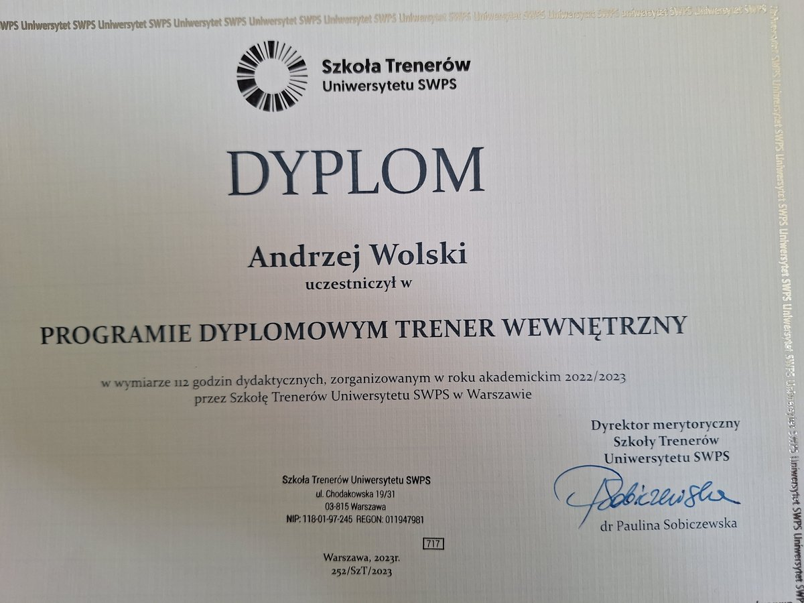
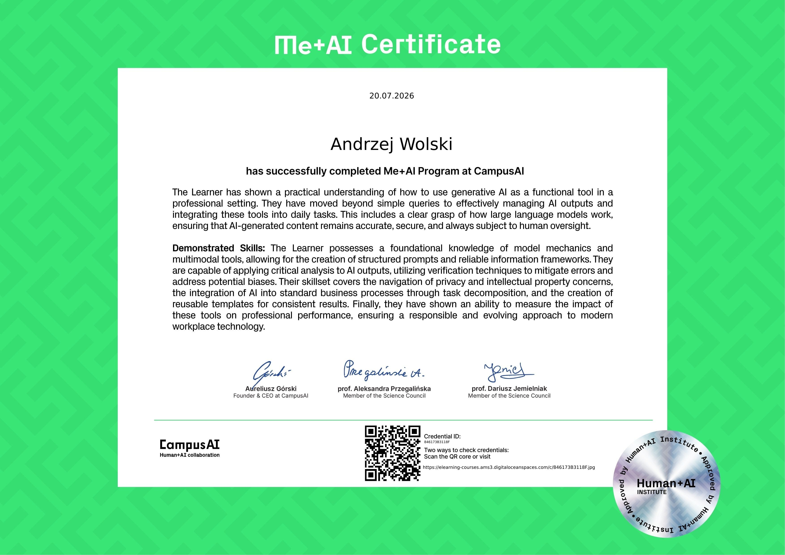
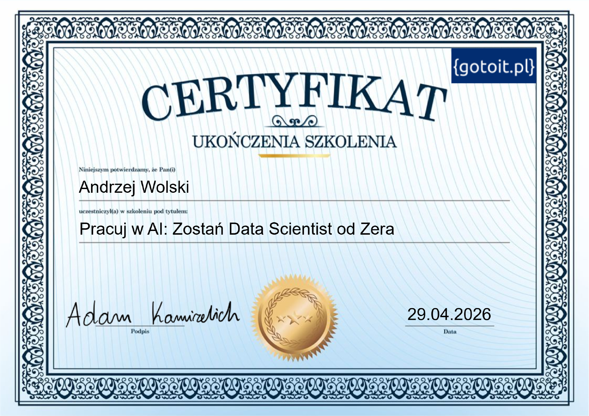

# O autorze

Przeżyłem jeden z najbardziej pomyślnych okresów historii naszej ojczyzny – od lat 50. ubiegłego wieku do lat 20. wieku bieżącego. Mimo różnych ocen tego okresu, był to czas bez wojny, czas totalnej edukacji społeczeństwa i czas bezprecedensowego rozwoju gospodarczego oraz dobrobytu Polski.

Wraz z obywatelami mojego Kraju wkraczam w nowy etap historii. Nie mamy jeszcze na ten etap dobrej nazwy. Wiem, że nowe czasy mogą być dla nas nadal łaskawe, ale równie dobrze mogą być okrutne i bezwzględne.

### Moja Wizja

Chcę mój kraj przygotować na trudne scenariusze, które wymagają:
* **Odporności** przetrwania,
* **Zdolności dostosowywania się** do każdych warunków.

> Obsesyjną ideą, która zawładnęła moją wyobraźnią, jest przygotowanie szeroko rozumianych elit w każdej dziedzinie naszego życia. Elit **szlachetnych, odważnych, zdyscyplinowanych i odpowiedzialnych**. 

Wiem, że wszystkich zaprosić do tego grona się nie da, ale trzeba się otworzyć na wszystkich, którzy będą chcieli walczyć, nie rezygnując z wartości.

!!! info "Rzeczpospolita Szlachetna"
    To kraj, w którym ludzie mają klasę nie od święta, tylko w rozmowie, sporze, pracy i w codziennym zachowaniu. **Dobro zawsze można odzyskać, o ile nie utraciło się prawdy.**

## 📜 Certyfikaty i szkolenia

### Szkoła Trenerów Uniwersytetu SWPS — Trener Wewnętrzny
*2023*

{: width="500" }

### Program ME+AI — Campus AI

{: width="500" }

### Pracuj w AI: Zostań Data Scientist od Zera
*gotoit.pl | kwiecień 2026*

[{: width="500" }](assets/certyfikat_AI_DataScientist.pdf)

[⬇️ Pobierz certyfikat (PDF)](assets/certyfikat_AI_DataScientist.pdf)